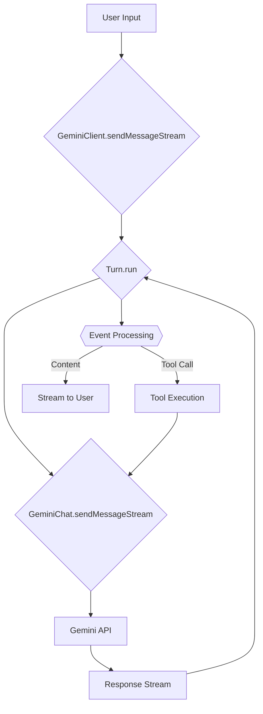
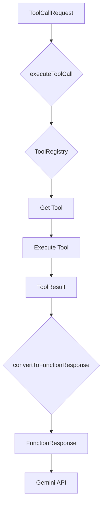
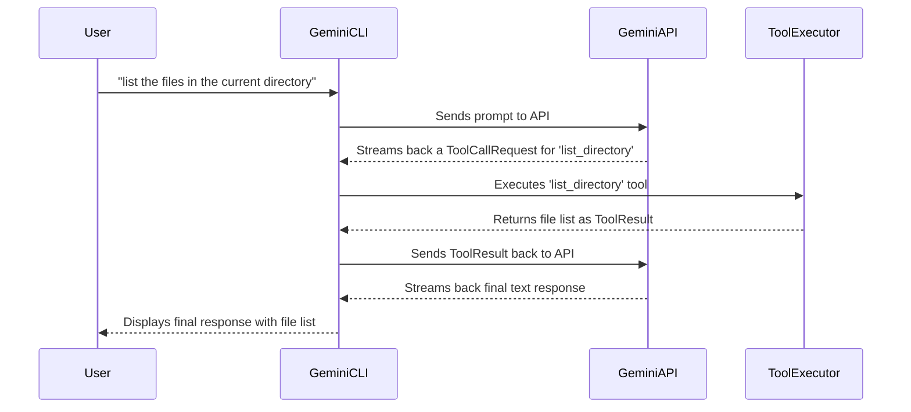
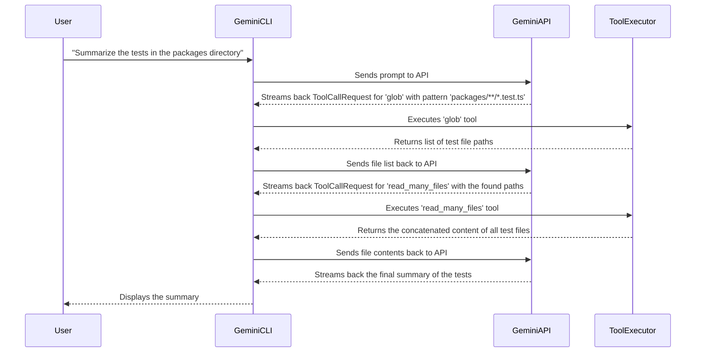

Have you ever wondered what goes on inside an AI-powered command-line tool? How does it understand your requests, execute commands, and interact with your file system, all while feeling like a natural extension of your workflow?

This week Google introduced Gemini-cli, which was kind of expected after claude-code and openAIs codex. But surprise-surprise google makes it [free and open-sourced](https://www.techrepublic.com/article/news-google-introduces-gemini-cli/)

Using the chance coding cli tool getting open-sourced, we're taking a deep dive into the internal architecture of the Gemini CLI's AI agent. We'll explore the core logic that powers its ability to reason, act, and learn from its interactions, transforming it from a simple command executor into a powerful development partner.

## The Core Engine: A "Reason-Act" (ReAct) Cycle

At the heart of the Gemini CLI agent is a design pattern known as the "Reason-Act" (ReAct) loop. This isn't just a simple back-and-forth conversation; it's a continuous cycle where the agent:

1.  **Reasons** about your request.
2.  **Acts** on it by using its available tools.
3.  **Observes** the results of those actions.
4.  **Repeats** the cycle, incorporating new observations until your goal is achieved.

This loop is what allows the agent to tackle complex, multi-step tasks that go far beyond the capabilities of a traditional chatbot.

Let's visualize this main loop:

### From Prompt to Action: A Step-by-Step Breakdown

1.  **User Input:** It all starts with your prompt in the Gemini CLI.
2.  **Initiating the Turn:** The `GeminiClient` kicks off the process, creating a "Turn" object to manage this specific exchange.
3.  **Sending to the Brain:** The `GeminiChat` object packages your prompt along with the conversation history and sends it to the Gemini API.
4.  **Receiving the Plan:** The API streams back a series of events. This isn't just text; it's a plan of action.
5.  **Processing the Plan:** The `Turn` object processes each event. If it's plain text, it's streamed directly to your terminal. But if it's a request to use a tool, the magic happens.
6.  **Taking Action:** The `ToolCallRequest` is handed off to the tool execution module.
7.  **Observing the World:** The result of that tool's execution is sent back to the Gemini API, feeding the agent new information to reason about.
8.  **Continuing the Cycle:** The agent continues this "reason-act-observe" cycle until your request is fully addressed.

## The "Act" in ReAct: How Tools are Executed

The "Act" phase of the cycle is where the agent interacts with your system. This is handled by a dedicated tool execution module that safely and efficiently runs the commands requested by the AI.

Here’s a look at the tool execution flow:

This process ensures that every tool call is properly requested, executed, and its result reported back to the agent's "brain" for the next phase of reasoning.

## Putting It All Together: Two Examples

Let's see how this plays out in practice.

### Example 1: A Simple File Listing

Imagine you ask: **"list the files in the current directory."**

Here, the agent reasons that it needs the `list_directory` tool, acts by calling it, observes the resulting file list, and then reasons that it can now formulate a final answer for you.

### Example 2: A More Complex, Multi-Step Task

Now for a more advanced request: **"Summarize the tests in the `packages` directory."**

This example showcases the true power of the ReAct loop. The agent forms a multi-step plan:

1.  **Reason:** I need to find the test files first.
2.  **Act:** Use the `glob` tool to find all `*.test.ts` files.
3.  **Observe:** I now have a list of file paths.
4.  **Reason:** Now I need to read the content of these files.
5.  **Act:** Use the `read_many_files` tool with the paths I just found.
6.  **Observe:** I have the full text of all the tests.
7.  **Reason:** I can now summarize this text to answer the user's request.
8.  **Act:** Generate the summary and display it.

## Summary: An Agent That Thinks

The Gemini CLI is more than just a command-line interface; it's a sophisticated AI agent. By leveraging a continuous Reason-Act cycle, it can break down complex problems, interact with its environment through tools, and learn from the results of its actions.

Understanding this internal architecture reveals a powerful and flexible system designed to be a true partner in your development workflow. It's a glimpse into the future of developer tools, where the line between command and conversation blurs, and your CLI doesn't just execute commands—it understands your goals.
